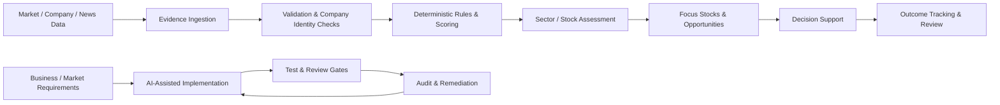
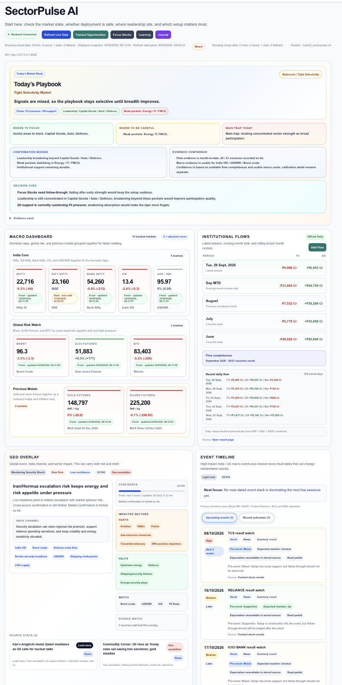

# SectorPulse

**A case study in turning a manual market-research process into a structured, auditable decision-support system through AI-assisted delivery.**

> **Project status:** Independent, local, single-user system used to support my own market analysis and trading decisions.  
> **Source code:** Private. This repository documents the product, delivery approach, architecture, quality controls, and selected lessons without exposing proprietary source code or private trading data.

---

## Why I built it

My market-research process involved screening stocks, assessing sectors, reviewing evidence, planning trades, and later checking whether the original reasoning held up.

The process was useful, but difficult to make consistent and difficult to audit.

I built **SectorPulse** to turn that methodology into explicit workflows, deterministic rules, scoring logic, validation checks, and measurable decision processes.

The goal was not to build an "AI stock picker." The core system is rule-based. The more interesting part of the project, from an operations and delivery perspective, was learning how to **direct AI coding agents under clear scope, testing, review, and evidence requirements**.

---

## My role

I conceived the product and led:

- problem definition and workflow design;
- requirements, acceptance criteria, and scope decisions;
- scoring and decision-framework design;
- prioritisation and roadmap trade-offs;
- extensive AI-assisted development using coding agents;
- test and review gates;
- audit, defect remediation, and re-validation;
- decisions on when outputs were trustworthy enough to use.

I am **not** presenting myself as the software engineer who manually wrote the entire codebase. Development was extensively AI-assisted. My role was to translate the business/market problem into a system, direct the implementation, review the output, identify failures, and decide what was accepted.

---

## What is built

SectorPulse is a financial-markets decision-support application with:

- a **500-stock universe**;
- **303 stocks mapped across 7 focus sectors**;
- market and sector dashboards;
- focus-stock and opportunity workflows;
- evidence ingestion and validation;
- deterministic stock, sector, and opportunity scoring;
- trade-planning and outcome-tracking workflows;
- a Python/FastAPI backend and Next.js frontend.

I actively use the **Dashboard** to understand market conditions and **Focus Stocks** to support stock selection and trading decisions.

---

## Architecture

### Core stack

- **Backend:** Python / FastAPI
- **Frontend:** Next.js
- **Data:** local JSON-based storage
- **Development workflow:** Git / GitHub
- **AI-assisted delivery:** Claude Code and Codex, with ChatGPT used for planning and review

### AI inside the product

Most production scoring and classification logic is **deterministic and rule-based**.

SectorPulse includes an optional LLM-generated daily brief, but that is not the basis of the core product and should not be interpreted as the system being "AI-powered."

---

## How I delivered it

I used a structured delivery model rather than asking coding agents to build features freely.

For major units, the workflow was generally:

**Problem definition → design → acceptance criteria → scoped implementation → automated testing → independent review → defect remediation → verification → merge**

The delivery process included:

- designs frozen before implementation for major units;
- staged work with clear scope boundaries;
- automated backend/frontend/build checks;
- independent review before acceptance;
- documented handoffs;
- evidence required before defects were considered closed.

This made the project slower in places, but it also surfaced problems that would otherwise have produced misleading outputs.

---

## Case 1 — A headline metric looked better than reality

The prediction tracker contained **1,200 captured records**.

An audit showed that many were repeated captures of the same underlying idea, leaving **160 distinct ideas**. It also showed that the evaluator was measuring whether a price level had been touched rather than whether the original thesis was actually correct.

Instead of continuing to report the more flattering number:

- the affected calibration was **quarantined from decision use**;
- the measurement assumptions were revisited;
- a replacement evaluation design based on distinct ideas and thesis-level outcomes was staged, but deliberately **not activated** until it could be validated properly.

### What this taught me

A metric can be technically correct and still answer the wrong business question.  
I would rather withdraw a flattering number than optimise decisions around a misleading one.

---

## Case 2 — Wrong-company news was influencing scores

An evidence-validation audit found examples where a headline could be associated with the wrong company.

Examples included:

- Cyient earnings affecting BEL;
- an Infosys forecast affecting TCS;
- an "M&M" text match on an unrelated confectionery story.

The same audit also exposed substring problems in tone matching, such as:

- **"miss"** matching inside **"missing"**;
- **"beat"** matching inside **"beaten-down"**.

A read-only audit reviewed **84 retained headlines** and rejected **25** under stronger validation rules.

The fix was to require positive company-identity evidence before a news item could affect scoring, alongside stricter text matching.

### What this taught me

Automation should not merely make a process faster. It has to preserve the identity, provenance, and meaning of the underlying data.

---

## Case 3 — Knowing when to stop adding controls

Because SectorPulse can influence real-money decisions, I initially placed heavy emphasis on correctness, traceability, testing, and controls.

That rigor was useful: the audits caught real problems.

But eventually, foundation and audit work began to consume effort without improving the user-facing intelligence enough. I made the decision to **redirect the roadmap back toward intelligence delivery** and defer non-essential control stages until a real requirement justified them.

### What I would do differently

If starting again, I would:

1. define the business-value metric earlier;
2. ship a narrower usable slice sooner;
3. scale controls in proportion to the risk rather than building them ahead of need.

---

## What this project demonstrates

SectorPulse is useful to me as a market tool, but the broader capability it demonstrates is operational:

- turning an ambiguous problem into a structured operating system;
- translating domain knowledge into requirements and measurable workflows;
- directing AI-assisted implementation without blindly trusting the output;
- creating quality gates and review loops;
- identifying data and measurement failures;
- making prioritisation trade-offs;
- withdrawing unreliable outputs instead of defending them;
- balancing rigor with user value.

That is the experience I am now looking to apply in **program management, AI-enabled operations, implementation, product operations, and cross-functional business operations** roles.

---

## Product screenshots

The screenshots below show the working product I use for market analysis and decision support. They contain no private source code, credentials, brokerage information, or personal trading data.

### Market Dashboard

A top-level market read combining the daily playbook, macro indicators, institutional flows, geopolitical context, event risk, and decision cues in one operating view.

### Focus Stocks

A decision workspace for reviewing repeat names, technical context, score, entry confidence, stance, event risk, and candidate rationale before a stock moves into active consideration.

### Sector Rotation Engine

A sector-level view that compares leadership, breadth, participation, macro/geopolitical drivers, event pressure, and representative stocks to explain where market strength is concentrated.

---

## Contact

**Shameem P.**  
Bengaluru, India  
[LinkedIn](https://www.linkedin.com/in/shameem-p-b26969b7)  
[GitHub](https://github.com/shameem28)
